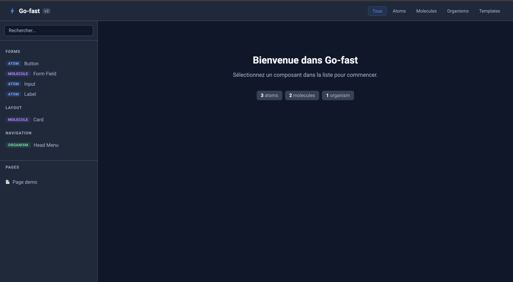
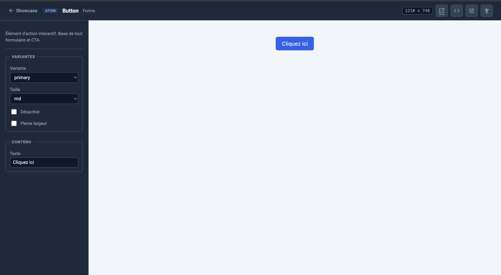

# Go-fast v2

Starter kit d'intégration HTML — Atomic Design + Showcase interactif + Multi-AI




---

## Installation

```bash
npm install
npm run init
npm run dev
```

`npm run init` configure le projet : nom, stratégie CSS, et scaffolde `dev/`.
Le showcase s'ouvre sur **http://localhost:3000**

---

## Stratégie CSS

Au lancement de `npm run init`, trois choix :

| Choix | Fichiers générés | Usage |
|-------|-----------------|-------|
| **SCSS seul** | `dev/assets/scss/style.scss` + base tokens | Défaut — BEM strict, design system SCSS |
| **Tailwind seul** | `dev/assets/style.css` | Classes utilitaires, pas de SCSS |
| **SCSS + Tailwind** | `dev/assets/scss/style.scss` | Tokens SCSS custom + utilitaires Tailwind |

La stratégie est stockée dans `gofast.config.json` et lue par Vite et les commandes IA.

---

## Commandes

```bash
npm run init       # Initialiser un nouveau projet (nom, CSS, scaffold dev/)
npm run dev        # Serveur de développement avec HMR
npm run build      # Build de production (→ public/)
npm run preview    # Prévisualiser le build
npm run icons      # Régénérer le sprite SVG et la doc des icônes
npm run test:a11y  # Lancer axe-core sur tous les composants
npm run reset      # Remettre dev/ à zéro sans reconfigurer
```

---

## Commandes IA

```
/new     → Créer un composant (atom / molecule / organism / template / page)
/edit    → Modifier un composant existant
/delete  → Supprimer un composant
/plan    → Planifier les tâches du projet
/dev     → Implémenter les tâches planifiées
```

> Les commandes lisent `gofast.config.json` et adaptent le scaffold à la stratégie CSS choisie.

---

## Structure

```
go-fast/
├── app/                      # Framework showcase — ne pas modifier
│   ├── scripts/              # showcase.js, welcome.js
│   ├── styles/               # showcase.scss (isolation totale)
│   └── templates/            # index.twig, page-showcase.twig
│
├── dev/                      # Votre projet — travaillez ici
│   ├── components/           # Atoms, molecules, organisms, templates
│   │   └── [nom]/
│   │       ├── [nom].json    # Source de vérité : level, variants, content
│   │       ├── [nom].twig    # Template Twig
│   │       └── [nom].md      # Documentation (obligatoire)
│   ├── pages/                # Pages complètes (.twig)
│   ├── assets/
│   │   ├── scss/
│   │   │   ├── base/         # Variables, reset, mixins, typographie
│   │   │   ├── components/   # Un fichier SCSS par composant
│   │   │   └── style.scss    # Point d'entrée (SCSS / hybride)
│   │   ├── style.css         # Point d'entrée (Tailwind seul)
│   │   └── icons/
│   │       ├── unitaires/    # SVG sources — déposez vos icônes ici
│   │       ├── sprite.svg    # Généré automatiquement
│   │       └── doc.html      # Doc visuelle générée automatiquement
│   └── data/
│       └── showcase.json     # Généré automatiquement — ne pas éditer
│
├── scripts/                  # Scripts Node du framework
├── templates/scss/base/      # Templates SCSS base (copiés par init)
├── GUIDELINES_AI.md          # Conventions complètes — lire avant de coder
├── gofast.config.json        # Config projet (CSS strategy, nom)
└── vite.config.js
```

---

## Créer un composant

### Avec l'IA

```
/new
```

La commande demande le niveau, le nom, la catégorie et crée les bons fichiers selon la stratégie CSS.

### Manuellement (SCSS)

1. `dev/components/[nom]/[nom].json`
2. `dev/components/[nom]/[nom].twig`
3. `dev/assets/scss/components/_[nom].scss`
4. Ajouter `@use 'components/[nom]';` dans `style.scss`
5. `dev/components/[nom]/[nom].md` — documentation obligatoire

### Manuellement (Tailwind seul)

1. `dev/components/[nom]/[nom].json`
2. `dev/components/[nom]/[nom].twig` (classes utilitaires Tailwind)
3. `dev/components/[nom]/[nom].md`

Voir `GUIDELINES_AI.md` pour toutes les règles.

---

## Icônes

Déposez un fichier `.svg` dans `dev/assets/icons/unitaires/` — le sprite et la doc sont régénérés automatiquement au prochain `npm run dev` (ou via `npm run icons`).

Utilisation dans un template Twig :

```twig

```

---

## Atomic Design

| Niveau | Emplacement | Description |
|--------|-------------|-------------|
| Atom | `dev/components/` | Élément indivisible — bouton, input, badge |
| Molecule | `dev/components/` | Composition d'atoms — champ de formulaire, carte |
| Organism | `dev/components/` | Composition de molecules — header, formulaire |
| Template | `dev/components/` | Structure de page sans contenu réel |
| Page | `dev/pages/` | Instance d'un template avec contenu réel |

---

## Accessibilité

Le showcase intègre **axe-core** : cliquez sur ♿ dans la barre du composant pour analyser l'accessibilité WCAG/RGAA en temps réel.

Pour une analyse complète en ligne de commande :

```bash
npm run test:a11y
```
